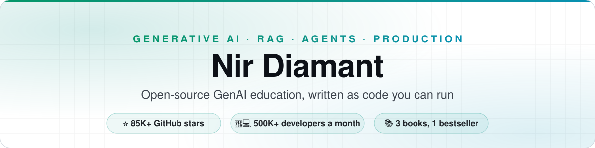
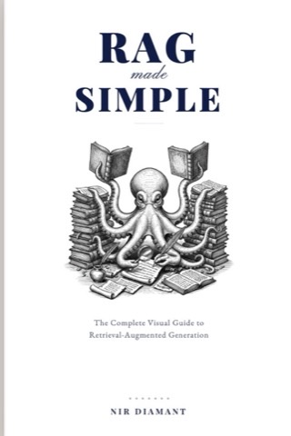
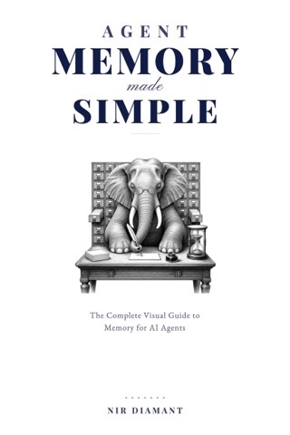
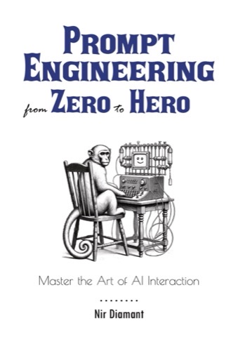

<a href="https://github.com/NirDiamant">
<picture>
  <source media="(prefers-color-scheme: dark)" srcset="assets/banner-dark.svg">
  
</picture>
</a>

 

I turn AI research into systems that hold up in production, and I teach it the same way: **runnable notebooks, not slide decks.** 
One course, six open-source repos, three books, and a weekly newsletter. Everything here is free to read and run.

 

  

**Start here:** &nbsp;
[Take the course](#-course-prompt-to-production) &nbsp;·&nbsp;
[Learn for free](#-open-source-learn-by-running-the-code) &nbsp;·&nbsp;
[Read the books](#-books-the-super-ai-engineering-series) &nbsp;·&nbsp;
[Get the newsletter](#-newsletter-and-community) &nbsp;·&nbsp;
[Work with me](#-work-with-me)

 

## 🎓 Course: Prompt to Production

**[Prompt to Production](https://europe-west1-rag-techniques-views-tracker.cloudfunctions.net/rag-techniques-tracker?notebook=github-profile-readme&click=course-full-cta&target=https%3A%2F%2Fwww.diamant-ai.com%2Fcourses%3Futm_source%3Dgithub%26utm_medium%3Dreadme%26utm_campaign%3Dgithub-profile&retarget=0&text=course-full-cta)** is my full course on building software with AI the way professionals do: the methods behind reliable, modular, production-grade systems, taught systematically. 17 modules, each pairing a video lecture with a hands-on lab, from your first structured prompt to a working production system. Every module is live.

### 🎁 Try a full module, free

<table>
<tr>
<td align="center">🎬 <b>7-minute video lecture</b></td>
<td align="center">🛠️ <b>Hands-on tutorial</b></td>
</tr>
</table>

 

## 📂 Open source: learn by running the code

Every repository is a curriculum. Each technique is a self-contained notebook you can open, run and adapt, with the intuition explained next to the code.

| Repository | What you will learn | Stars |
| :--- | :--- | :---: |
| **[RAG Techniques](https://github.com/NirDiamant/RAG_Techniques)** | 41 retrieval-augmented generation techniques, from chunking and reranking to agentic, graph-based and self-correcting RAG, plus an evaluation suite. |  |
| **[GenAI Agents](https://github.com/NirDiamant/GenAI_Agents)** | 59 agent implementations, from a single conversational bot to multi-agent and self-improving systems, across LangGraph, AutoGen and PydanticAI. |  |
| **[Agents Towards Production](https://github.com/NirDiamant/agents-towards-production)** | The playbook for shipping agents: orchestration, memory, security, observability, evaluation, deployment, GPU serving and fine-tuning. |  |
| **[Prompt Engineering](https://github.com/NirDiamant/Prompt_Engineering)** | 22 prompting techniques, from basic structure through chain-of-thought, self-consistency, prompt security and systematic evaluation. |  |
| **[Controllable RAG Agent](https://github.com/NirDiamant/Controllable-RAG-Agent)** | One complete reference agent: a deterministic graph that plans, decomposes questions, retrieves across stores and verifies its own groundedness. |  |
| **[Agent Memory Techniques](https://github.com/NirDiamant/Agent_Memory_Techniques)** | 30 notebooks on memory for agents: buffers, vector and graph stores, cognitive architectures, Mem0, Letta, Zep, Graphiti and LoCoMo benchmarks. |  |

**Smaller tools:** [claude-watch](https://github.com/NirDiamant/claude-watch) (live observability for Claude Code sessions) · [Agentic Engineering](https://github.com/NirDiamant/Agentic_Engineering) (a docs layer that gives your coding agent a memory of your project) · [moltbook-agent-guard](https://github.com/NirDiamant/moltbook-agent-guard) (prompt-injection scanning and guardrails for agents)

 

## 📚 Books: the Super AI Engineering series

Visual, intuition-first guides. Each one turns a repo above into a book you can read end to end, with diagrams that make the tricky parts click. PDF and EPUB, free lifetime updates, and chapter 1 of each is free to read.

<table>
<tr>
<td align="center" width="33%" valign="top">

  
<b><a href="https://europe-west1-rag-techniques-views-tracker.cloudfunctions.net/rag-techniques-tracker?notebook=github-profile-readme&click=book-rag-cta&target=https%3A%2F%2Fdiamant-ai.com%2Frag-made-simple%3Fcode%3DRAGKING%26utm_source%3Dgithub%26utm_medium%3Dreadme%26utm_campaign%3Dgithub-profile%26utm_content%3Dbook-rag-cta&retarget=0&text=book-rag-cta">RAG Made Simple</a></b>
 
🏆 Amazon Bestseller in Generative AI (hit #1 at launch)
  
400 pages, 22 techniques, with side-by-side comparisons and diagrams.
  
33% off with code <b>RAGKING</b>
</td>
<td align="center" width="33%" valign="top">

  
<b><a href="https://europe-west1-rag-techniques-views-tracker.cloudfunctions.net/rag-techniques-tracker?notebook=github-profile-readme&click=book-amt-cta&target=https%3A%2F%2Fwww.diamant-ai.com%2Fagent-memory-made-simple%3Futm_source%3Dgithub%26utm_medium%3Dreadme%26utm_campaign%3Dgithub-profile%26utm_content%3Dbook-amt-cta&retarget=0&text=book-amt-cta">Agent Memory Made Simple</a></b>
 
✨ New: the complete visual guide to memory for AI agents
  
467 pages on how agents remember: buffers, vector and graph memory, cognitive architectures and the frameworks in production.
</td>
<td align="center" width="33%" valign="top">

  
<b><a href="https://europe-west1-rag-techniques-views-tracker.cloudfunctions.net/rag-techniques-tracker?notebook=github-profile-readme&click=book-pe-cta&target=https%3A%2F%2Fwww.diamant-ai.com%2Fprompt-engineering%3Futm_source%3Dgithub%26utm_medium%3Dreadme%26utm_campaign%3Dgithub-profile%26utm_content%3Dbook-pe-cta&retarget=0&text=book-pe-cta">Prompt Engineering from Zero to Hero</a></b>
 
📖 Master the art of AI interaction
  
22 chapters of hands-on prompting techniques. The foundation that makes RAG and agents work better.
</td>
</tr>
</table>

**Want all three?** The [Applied AI Bundle](https://europe-west1-rag-techniques-views-tracker.cloudfunctions.net/rag-techniques-tracker?notebook=github-profile-readme&click=bundle-cta&target=https%3A%2F%2Fwww.diamant-ai.com%2Fapplied-ai-bundle%3Futm_source%3Dgithub%26utm_medium%3Dreadme%26utm_campaign%3Dgithub-profile%26utm_content%3Dbundle-cta&retarget=0&text=bundle-cta) is prompting, retrieval and memory in one purchase, $48 less than buying them separately.

 

## 💌 Newsletter and community

- **[DiamantAI Newsletter](https://europe-west1-rag-techniques-views-tracker.cloudfunctions.net/rag-techniques-tracker?notebook=github-profile-readme&click=newsletter-list&target=https%3A%2F%2Fnewsletter.diamant-ai.com%3Futm_source%3Dgithub%26utm_medium%3Dreadme%26utm_campaign%3Dgithub-profile%26utm_content%3Dnewsletter-list&retarget=0&text=newsletter-list)**: one deep dive a week on GenAI engineering, with code. Free, read by 50k+ engineers.
- **[Discord](https://discord.gg/cA6Aa4uyDX)**: 4k+ members, real-time Q&A and project feedback.
- **[YouTube](https://www.youtube.com/@DiamantAI)**: the tutorials, as video walkthroughs.
- **[LinkedIn](https://www.linkedin.com/in/nir-diamant-ai/)** and **[X](https://x.com/NirDiamantAI)**: daily notes on what is new and what actually works.
- **[r/EducationalAI](https://www.reddit.com/r/EducationalAI/)**: discuss prompts, RAG and agent design.

 

## 🤝 Work with me

If you build for the GenAI stack (vector databases, orchestration, memory, observability, security, evaluation), we can co-create an open-source tutorial that shows your tool inside a real, runnable workflow.

- **Reach**: 500,000+ developer views a month across the repositories, plus the newsletter and community.
- **Format**: clear, reproducible notebooks with no paywall, kept neutral and end to end.
- **Track record**: the teams below have already done it.

| | | | | |
| :---: | :---: | :---: | :---: | :---: |
| <a href="https://aws.amazon.com"><picture><source media="(prefers-color-scheme: dark)" srcset="https://raw.githubusercontent.com/NirDiamant/NirDiamant/main/assets/aws_white.png"></picture></a> | <a href="https://langchain.com"><picture><source media="(prefers-color-scheme: dark)" srcset="https://raw.githubusercontent.com/NirDiamant/agents-towards-production/main/assets/repos_images/sponsors_logos/trimmed_padded/trimmed_padded_langchain_white.png"></picture></a> | <a href="https://mistral.ai"><picture><source media="(prefers-color-scheme: dark)" srcset="https://raw.githubusercontent.com/NirDiamant/NirDiamant/main/assets/mistral-dark.svg"></picture></a> | <a href="https://www.llamaindex.ai"><picture><source media="(prefers-color-scheme: dark)" srcset="https://raw.githubusercontent.com/NirDiamant/NirDiamant/main/assets/llamaindex-dark.svg"></picture></a> | <a href="https://redis.io"><picture><source media="(prefers-color-scheme: dark)" srcset="https://raw.githubusercontent.com/NirDiamant/agents-towards-production/main/assets/repos_images/sponsors_logos/trimmed_padded/trimmed_padded_Redis_white.svg"></picture></a> |
| <a href="https://tavily.com"><picture><source media="(prefers-color-scheme: dark)" srcset="https://raw.githubusercontent.com/NirDiamant/agents-towards-production/main/assets/repos_images/sponsors_logos/trimmed_padded/trimmed_padded_tavily_white.png"></picture></a> | <a href="https://mem0.ai"><picture><source media="(prefers-color-scheme: dark)" srcset="https://raw.githubusercontent.com/NirDiamant/agents-towards-production/main/assets/repos_images/sponsors_logos/trimmed_padded/Mem0%20Word%20Logo.png"></picture></a> | <a href="https://coderabbit.ai"><picture><source media="(prefers-color-scheme: dark)" srcset="https://raw.githubusercontent.com/NirDiamant/agents-towards-production/main/assets/repos_images/sponsors_logos/trimmed_padded/coderabbit_Dark_Type_Mark.png"></picture></a> | <a href="https://www.inngest.com"><picture><source media="(prefers-color-scheme: dark)" srcset="https://raw.githubusercontent.com/NirDiamant/NirDiamant/main/assets/inngest_white.svg"></picture></a> |  |
| <a href="https://brightdata.com"><picture><source media="(prefers-color-scheme: dark)" srcset="https://raw.githubusercontent.com/NirDiamant/agents-towards-production/main/assets/repos_images/sponsors_logos/trimmed_padded/trimmed_padded_brightdata_white.svg"></picture></a> | <a href="https://runpod.io"><picture><source media="(prefers-color-scheme: dark)" srcset="https://raw.githubusercontent.com/NirDiamant/agents-towards-production/main/assets/repos_images/sponsors_logos/trimmed_padded/trimmed_padded_runpod_white.svg"></picture></a> | <a href="https://zilliz.com"><picture><source media="(prefers-color-scheme: dark)" srcset="https://raw.githubusercontent.com/NirDiamant/NirDiamant/main/assets/zilliz_white.png"></picture></a> | <a href="https://contextual.ai"><picture><source media="(prefers-color-scheme: dark)" srcset="https://raw.githubusercontent.com/NirDiamant/agents-towards-production/main/assets/repos_images/sponsors_logos/trimmed_padded/trimmed_padded_contextual_white.png"></picture></a> | <a href="https://www.jetbrains.com"><picture><source media="(prefers-color-scheme: dark)" srcset="https://raw.githubusercontent.com/NirDiamant/agents-towards-production/main/assets/repos_images/sponsors_logos/trimmed_padded/trimmed_padded_jetbrains_white.svg"></picture></a> |

Interested? Reach me on <b><a href="https://www.linkedin.com/in/nir-diamant-ai/">LinkedIn</a></b> or through <b><a href="https://www.diamant-ai.com/">diamant-ai.com</a></b>.

 

## ❤️ Keep it free

Everything above stays free because people do three small things:

- **Star** the repositories you use. It is how other developers find them.
- **Share** a notebook with your team or on social media.
- **Sponsor** through [GitHub Sponsors](https://github.com/sponsors/NirDiamant) or [Buy Me a Coffee](https://buymeacoffee.com/diamantai).

Thank you for helping keep Generative AI education free for everyone 🙏

